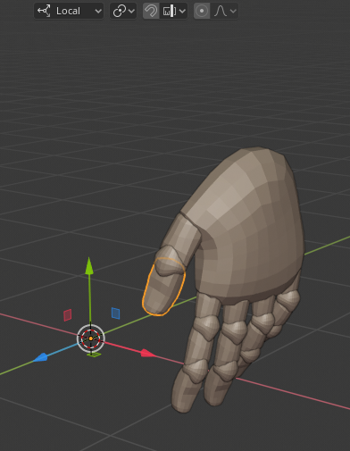
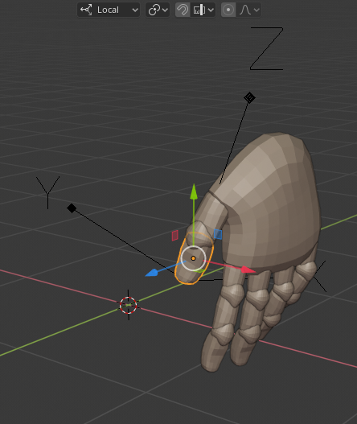
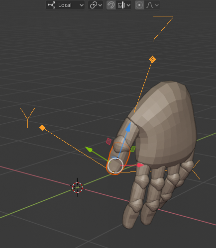
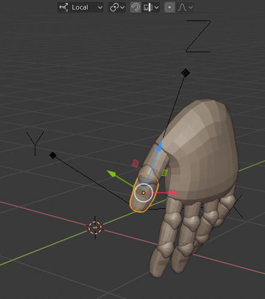

# Align Local Axis

This Blender (2.8) add-on rotates the local axis of the selected object to align with either the local axis of the active object, the axis of a custom transform, or the orientation of the 3D cursor. The object's vertices and origin remain in the same location in world space, any scale on the object will be applied.

After installation: 3D Viewport > Object > Transform > align local

If multiple objects are selected the local axis direction is taken from the active object (last object selected - light orange outline)

If a single object is selected, and there is a custom transform orientation active, the object's local axis will be aligned with the custom transform.

If a single object is selected and their is no custom orientation the orientation of the 3D cursor is used.

## Purpose

When importing from file formats such as obj, no local axis information is available. All objects have their origin at the world origin and a local axis rotated 90 degrees to the Blender world axis. The Object > Set Origin > Origin to Geometry can be used to move the origin but I can't find an easy way I can remember to align the objects local axis with its geometry so that scaling can be easily applied.

This add-on can be used after an empty has been snapped to a face and rotated into the desired position.  A custom transform, or the 3D cursor can be used in the same way to set the desired orientation of the local axis.

After importing an obj file, all origins are at the world origin

Set Origin to Geometry and add an empty aligned with the thumb joint.

Select the thumb joint then shift select the empty

Run the add-on, the local axis of the the thumb joint is now aligned with the empty.

If anyone knows how to do this easily with stuff already built into Blender let me know.
